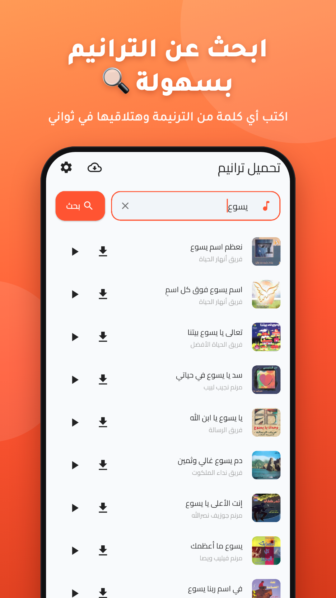
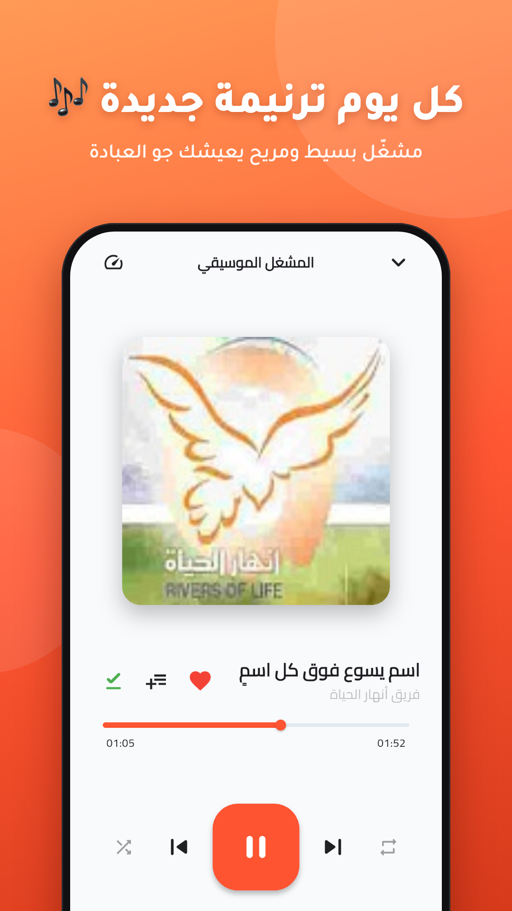
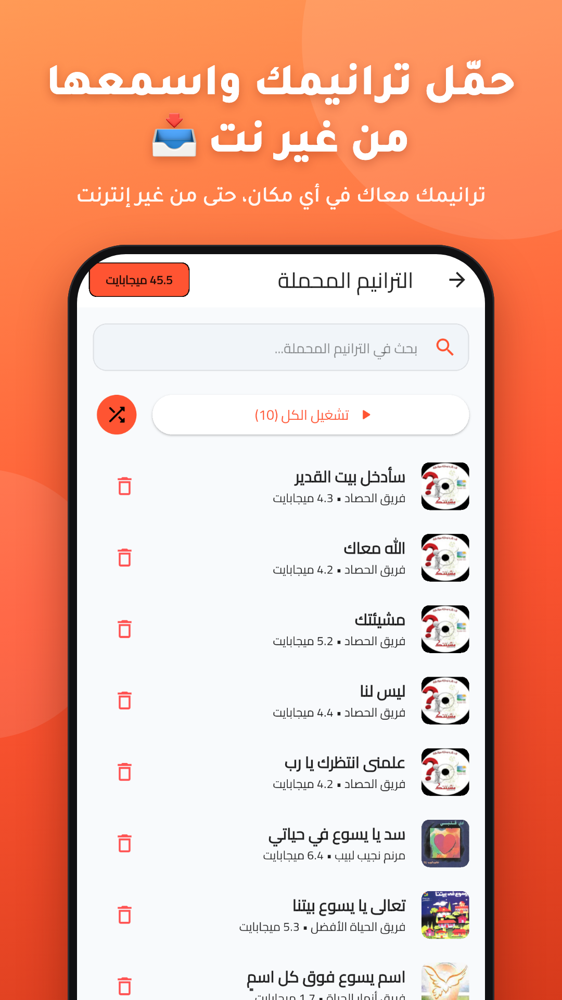
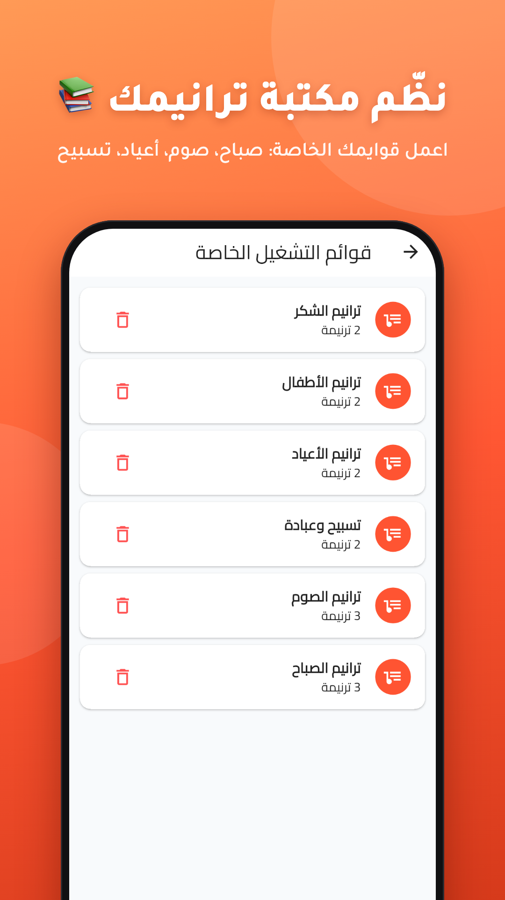

# Traneemna — تحميل ترانيم

<a href="https://play.google.com/store/apps/details?id=com.increase.tarneemna&referrer=utm_source%3Dmy-github-apppage">

</a>

Traneemna is an Android app to search, listen to and download Arabic hymns with ease.

<a href="https://play.google.com/store/apps/details?id=com.increase.tarneemna&referrer=utm_source%3Dmy-github-apppage">

</a>

<p>




</p>

## Features

- **Search** hymns across the Taranim Arabia catalogue and YouTube, with recent searches.
- **Discover** featured hymns, albums and singers, with infinite scrolling.
- **Player** with background playback, queue, shuffle/repeat, sleep timer, A-B repeat, lyrics, chords and sheet music.
- **Offline downloads**: every download is stored inside the app and listed under "الترانيم المحملة", with a storage manager.
- **Library**: favorites, playlists and listening history.
- **Appearance**: light, dark and OLED themes (or follow the system), accent colors and adjustable font size.
- Arabic-first, right-to-left UI.

## Tech stack

- Flutter (Dart SDK `>=3.2.0 <4.0.0`)
- State management and DI: [Riverpod](https://riverpod.dev), with [GetX](https://pub.dev/packages/get) for navigation and a few reactive widgets
- Audio: `just_audio` and `audio_service`
- Storage: `hive_flutter`
- Sources: Taranim Arabia (HTML scraping) and `youtube_explode_dart`
- Firebase Analytics

The code is organised by feature under `lib/features/` (audio, albums, singers, discovery, downloads, hymns, library, lyrics, search, settings, taranim_arabia, youtube); the home screen and legacy GetX pieces live in `lib/screens/`.

## Getting started

```sh
flutter pub get
flutter run
```

Run the checks with:

```sh
flutter analyze
flutter test
```

Release builds read their signing config from `android/key.properties` (see `android/app/build.gradle`); without it only debug builds work. Firebase is configured in `lib/firebase_options.dart`.

## Store screenshots

The Play Store screenshots are composed from raw device captures. Edit the headlines in `store-screenshots/build.py` and run:

```sh
python3 store-screenshots/build.py
```

See [`store-screenshots.md`](store-screenshots.md) for the full plan, including the iOS sizes.

## Changelog

See [`CHANGELOG.md`](CHANGELOG.md).
